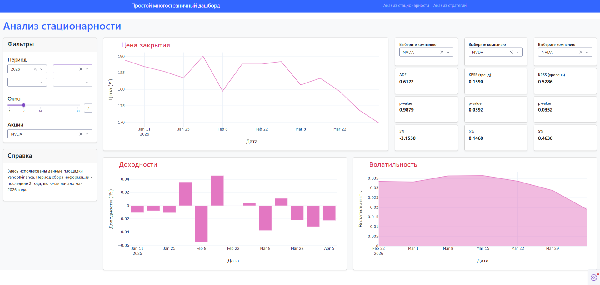
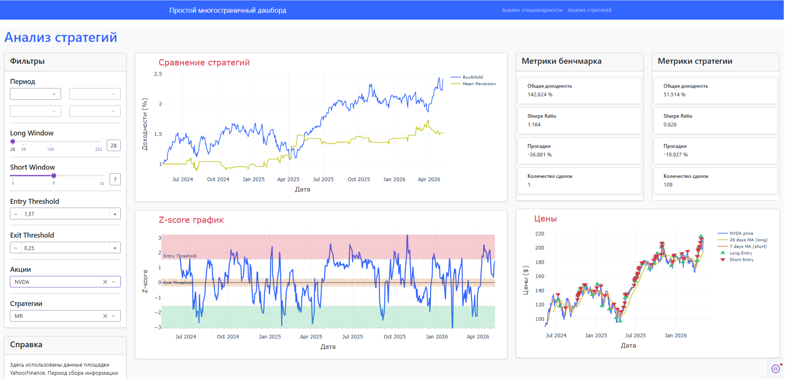

# dash-demo-dashboard

Демонстрация базовых возможностей фреймворка Dash для создания многостраничных интерактивных аналитических панелей (дашбордов, dashboards).

Демонстрация создана в учебных целях при написании курсового проекта.

У дашборда две страницы, представленные на рисунках ниже.

